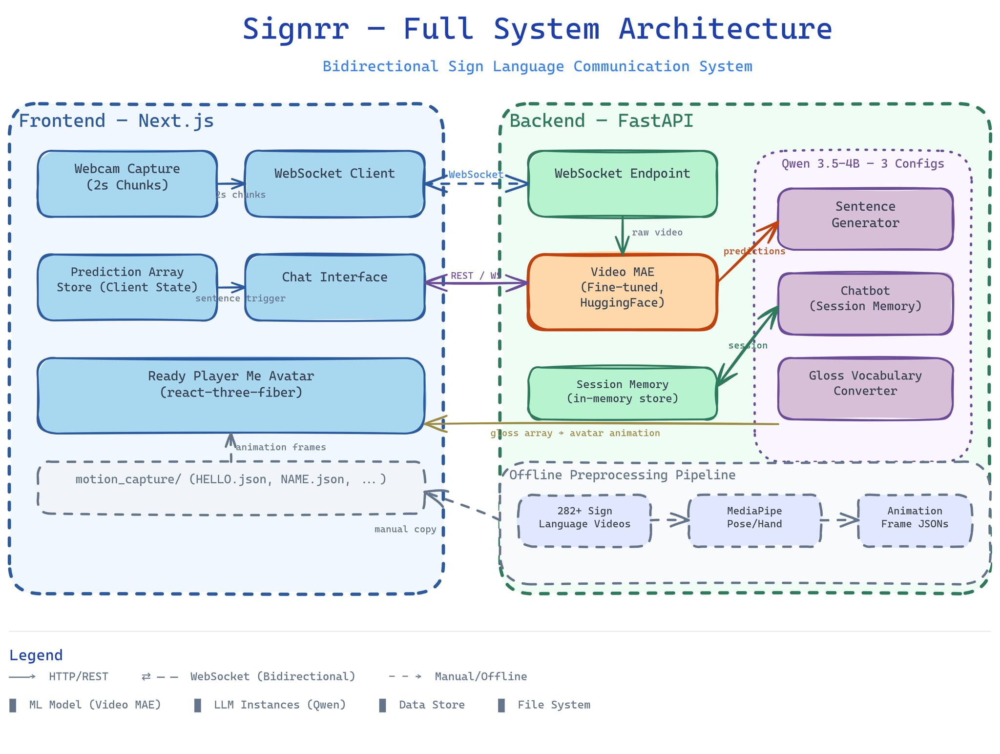
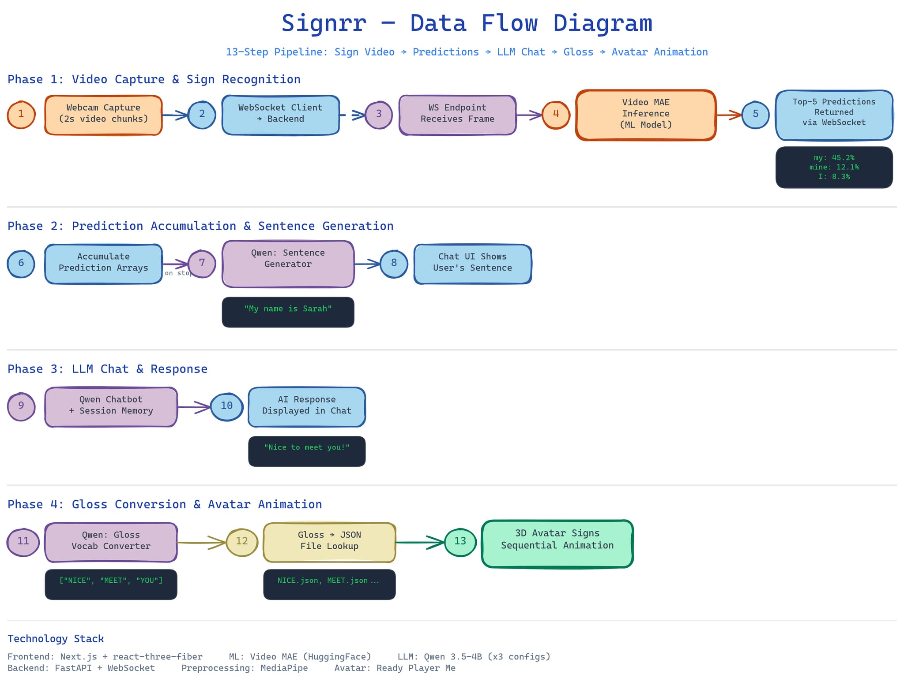

# 🤟 Signrr GPT (Sign Language GPT)

### Technology should meet people where they are — not the other way round.

_It's embarrassing this doesn't exist yet. So I'm building it._

---

## 🌍 The Problem

70+ million people worldwide are deaf or hard of hearing. Yet most technology still expects them to adapt — to read, to type, to lip-read.

**That's backwards.**

We can't build humanity-changing technology without involving everybody in the room.

---

## 💡 The Solution

**Sign Language GPT** is a real-time, bi-directional sign language interpreter:

| Direction | What It Does                                |
| --------- | ------------------------------------------- |
| 🤟 → 📝   | Translates sign language into text using AI |
| 📝 → 🤟   | A 3D avatar signs back to you               |

True two-way communication. No typing required.

---

## 📦 Repositories

| Repo                                                                     | Stack                      | Description                             |
| ------------------------------------------------------------------------ | -------------------------- | --------------------------------------- |
| [**Frontend**](https://github.com/Okeha/sign-language-detector-frontend) | React, TypeScript, ThreeJS | Real-time interface + 3D signing avatar |
| [**Backend**](https://github.com/Okeha/sign-language-translator-backend) | Python, FastAPI, VideoMAE  | AI recognition + animation generation   |

---

## 🏗️ Architecture

Below are visual diagrams showing the system architecture and data flow. Click or open the images in the `images/` folder for a larger view.

    

    

---

## 🚀 Current Status

| Feature                           | Status         |
| --------------------------------- | -------------- |
| Hand tracking (MediaPipe)         | ✅ Working     |
| Sign recognition (VideoMAE)       | ✅ Working     |
| Text-to-Sign avatar               | 🟡 In Progress |
| Real-time translation             | 🔜 Coming Soon |
| Multi-language support (ASL, BSL) | 🔜 Planned     |

---

## 🛠️ Tech Stack

  
  
  
  
  
  
  
  

---

## 🤝 Contributing

This project is in active development. If you're passionate about accessibility, AI, or just want to help — PRs are welcome!

---

**Built by [Anthony Okeh](https://github.com/Okeha)**

_Because everyone deserves to be heard._ 🤟

