```mermaid
flowchart TB
    subgraph Frontend["🎨 FRONTEND"]
        A["📹 Camera Input"] --> B["✋ MediaPipe Tracking"]
        B --> C["📡 Send to API"]
        G["📝 Display Text"] --> H["🧍 3D Avatar Signs Back"]
    end
    
    subgraph Backend["🧠 BACKEND"]
        D["🎬 VideoMAE Encoder"] --> E["🤖 Sign Classification"]
        E --> F["📝 Text Output"]
    end
    
    C --> D
    F --> G
```

# 🤟 Signrr GPT  (Sign Language GPT)

### Technology should meet people where they are — not the other way round.

*It's embarrassing this doesn't exist yet. So I'm building it.*

---

## 🌍 The Problem

700+ million people worldwide are deaf or hard of hearing. Yet most technology still expects them to adapt — to read, to type, to lip-read.

**That's backwards.**

We can't build humanity-changing technology without involving everybody in the room.

---

## 💡 The Solution

**Sign Language GPT** is a real-time, bi-directional sign language interpreter:

| Direction | What It Does |
|-----------|--------------|
| 🤟 → 📝 | Translates sign language into text using AI |
| 📝 → 🤟 | A 3D avatar signs back to you |

True two-way communication. No typing required.

---

## 📦 Repositories

| Repo | Stack | Description |
|------|-------|-------------|
| [**Frontend**](https://github.com/Okeha/sign-language-detector) | React, TypeScript, ThreeJS | Real-time interface + 3D signing avatar |
| [**Backend**](https://github.com/Okeha/sign-language-detector-frontend) | Python, FastAPI, VideoMAE | AI recognition + animation generation |

---

## 🏗️ Architecture

## 🏗️ Architecture

---

## 🚀 Current Status

| Feature | Status |
|---------|--------|
| Hand tracking (MediaPipe) | ✅ Working |
| Sign recognition (VideoMAE) | 🟡 In Progress |
| Text-to-Sign avatar | 🟡 In Progress |
| Real-time translation | 🔜 Coming Soon |
| Multi-language support (ASL, BSL) | 🔜 Planned |

---

## 🛠️ Tech Stack

  
  
  
  
  
  
  
  

---

## 🤝 Contributing

This project is in active development. If you're passionate about accessibility, AI, or just want to help — PRs are welcome!

---

**Built by [Anthony Okeh](https://github.com/Okeha)**

*Because everyone deserves to be heard.* 🤟

